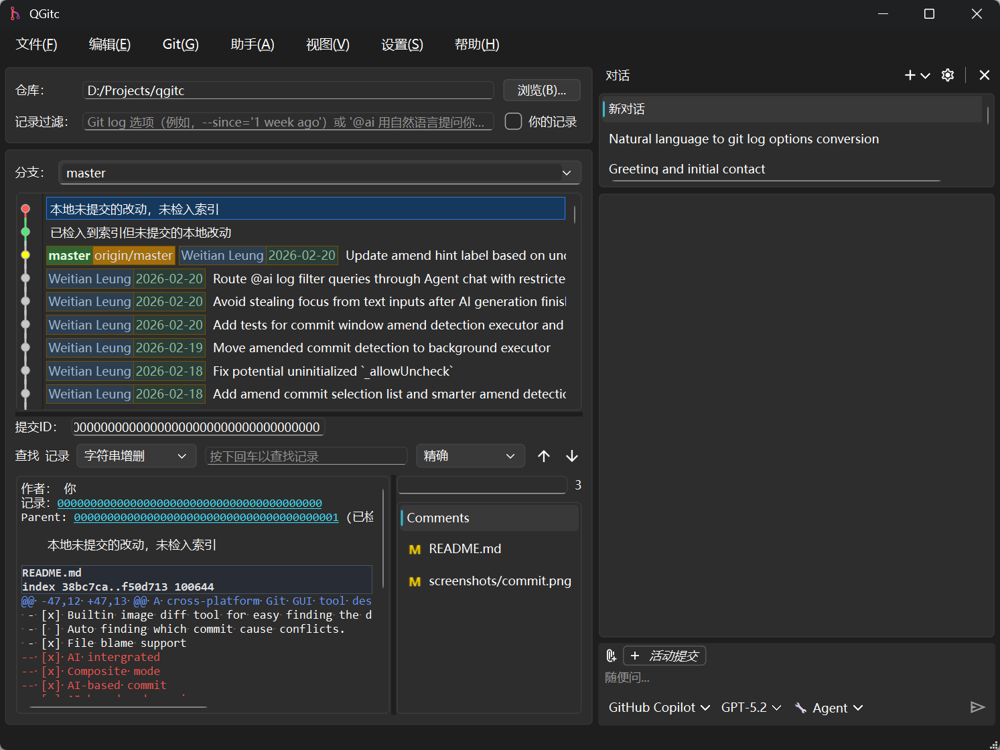
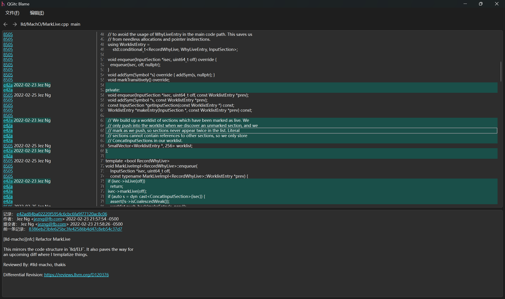
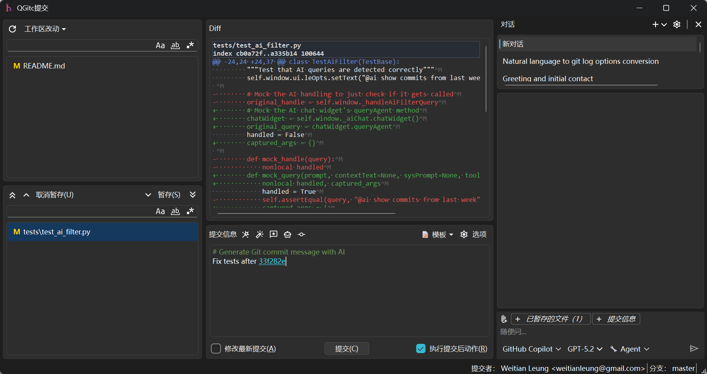
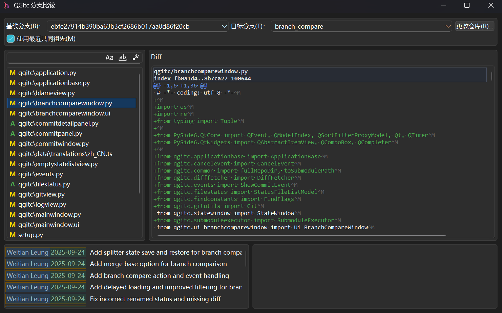
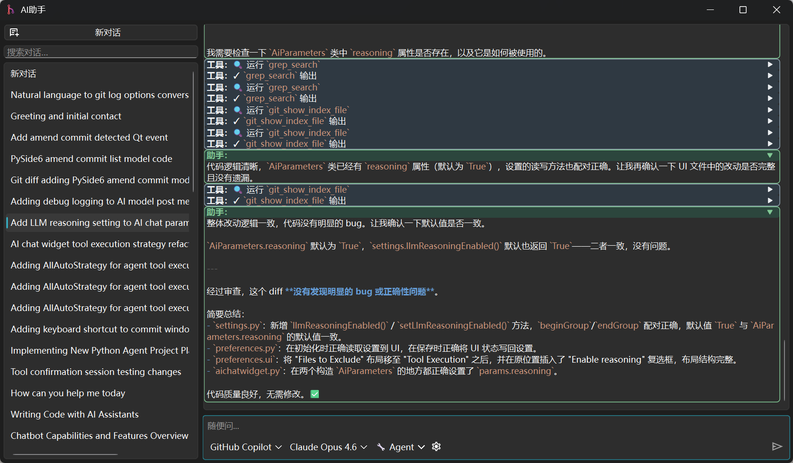
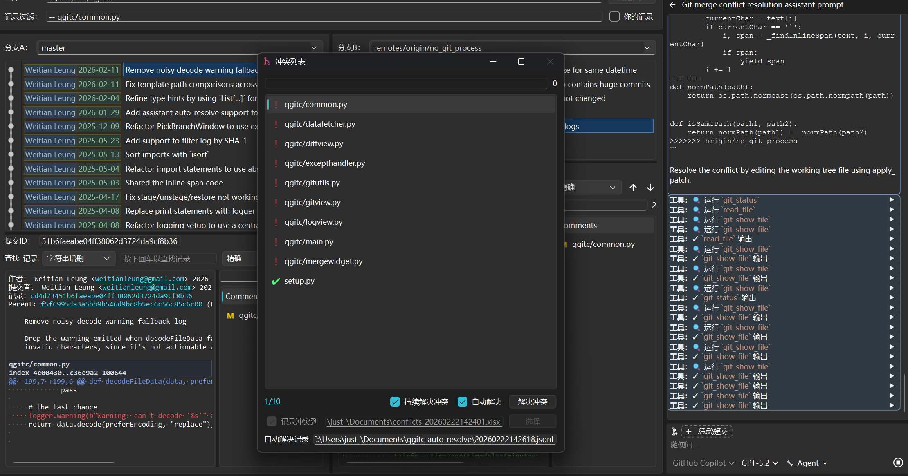
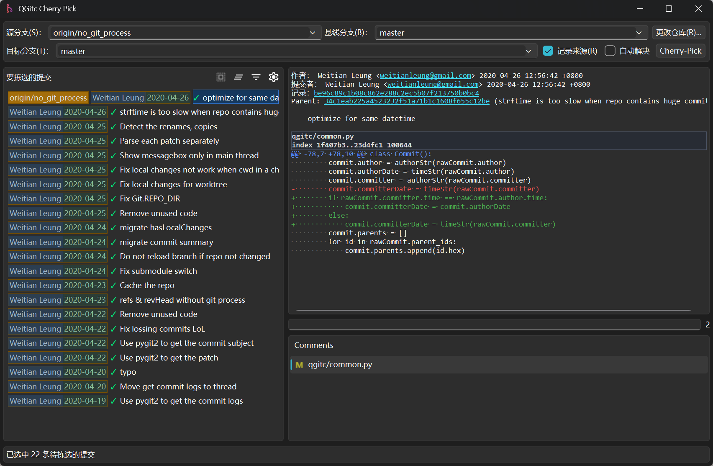

# QGitc

[](https://github.com/timxx/qgitc/actions)
[](https://github.com/timxx/qgitc/actions)
[](https://github.com/timxx/qgitc/actions)
[](https://pypi.org/project/qgitc)
[](https://pypi.org/project/qgitc)
[](LICENSE)


A cross-platform Git GUI tool designed to simplify commit history exploration, blame tracking, committing changes, and resolving conflicts. Leverage AI for generating commit messages and performing code reviews.


## Screenshots

### Main Window


### Blame Window


### Commit Window


### Branch Compare Window


### AI Assistant


### Merge Tool


### Cherry-Pick


## Features

- [x] Two branches view for easy comparing a conflict commit base on the file.
- [x] Visualize white spaces and carriage return for easy diff compare.
- [x] Syntax highlight for diff contents.
- [x] Filter logs by file path or commit pattern.
- [x] Copy commit summary as HTML format for pasting.
- [x] Custom pattern for creating links.
- [x] Collect conflict files for merging.
- [x] Launch specify merge tool for specify file suffix.
- [x] Builtin image diff tool for easy finding the difference.
- [ ] Auto finding which commit cause conflicts.
- [x] File blame support
- [x] AI intergrated
- [x] Composite mode
- [x] AI-based commit
- [x] AI-based code review
- [x] Branch compare, to show full changes for two branches
- [x] Cherry-Pick, support drag & drop and pick full branch


## Requirements

- `pip install -r requirements.txt`
- git (command line)
- pywin32
  - Optional for Windows if you want record the conflict log easily
- pywpsrpc
  - Optional for Linux if you want record the conflict log easily
- openpyxl
  - Optional if no pywin32/ pywpsrpc is available


## Build & Run

- Using source directly
  - Run **python setup.py build** to build the project
  - Run **qgitc.py** under project root directory.

- Build from source
  - Run *pip install .* under project root directory to install qgitc, and then run *qgitc* command.

- Install from pypi
  - pip install qgitc


## Shell Integration

``` sh
qgitc shell register
# to unregister, run:
qgitc shell unregister

# to use the source directly:
python qgitc.py shell register

# for Linux user
# if your file manager isn't the default one comes with desktop
# say your desktop is Ubuntu, but use thunar as default one
# use --file-manager to specify reigster for
qgitc shell register --file-manager=thunar
```

## Icons

Most of the [SVG icons](./qgitc/data/icons/) come from [Google Fonts](https://fonts.google.com/icons).

Some were resized with Inkscape to match the size for QGitc.
